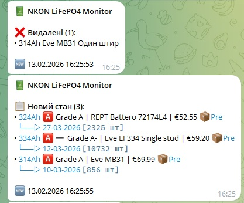
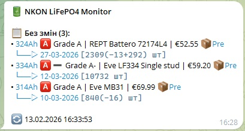

# 🔋 NKON LiFePO4 Monitor

<p align="center">
  
</p>

Автоматизований моніторинг батарей LiFePO4 ємністю ≥200Ah на сайті [NKON](https://www.nkon.nl) з миттєвими сповіщеннями в Telegram та відстеженням змін.

> [!TIP]
> **Для розгортання на Proxmox сервері:** Дивіться детальний гайд → [PROXMOX_DEPLOYMENT.md](PROXMOX_DEPLOYMENT.md)

> [!NOTE]
> **Публікація на GitHub:** Хочете використовувати `git clone` для встановлення? → [GITHUB_QUICKSTART.md](GITHUB_QUICKSTART.md)

## 📋 Можливості

- 🛡️ **Anti-Ban захист:** Реалістичні заголовки, випадкові затримки, requests session
- 🔐 **Log Masking:** Маскування токенів та ID чатів у логах для безпеки
- 💰 **Аналіз цін:** Відстеження змін цін з точністю до цента
- 📊 **Розумні сповіщення:** 
  - **Granular Notifications:** Окремі списки чатів для повних звітів (`FULL`) та тільки для змін (`CHANGES_ONLY`)
  - **Dual Message Flow:** При змінах - два повідомлення: зміни (зі звуком 🔔) + "Новий стан" (беззвучно 🔕)
  - **Smart Message Editing:** Повідомлення "Новий стан" автоматично редагується на "Без змін" (оновлюється час), не спамить канал
  - Показує відсоток зміни ціни (наприклад: `🔴+5.6%` або `🟢-10.1%`)
  - Ігнорує незначні коливання (менше 5%)
- 🔄 **Моніторинг змін:** Нові товари, зміни цін, зміни статусу наявності
- 📉 **Cumulative Stock Tracking:** Розумне відстеження падіння залишків. Поки повідомлення "Без змін" редагується, скрипт сумує падіння залишків (наприклад, було 100 -> стало 90, покаже diff -10).
- 💾 **Бекап стану:** Автоматичне збереження попереднього стану (`state.previous.json`) перед кожним оновленням
- 📅 **Нормалізація дат:** Дати доставки завжди у форматі `DD-MM-YYYY` (запобігає хибним змінам)
- ✅ Моніторинг товарів **In Stock** та **Pre-order**
- ✅ Автоматичний парсинг сайту з підтримкою JavaScript (Selenium)
- ✅ Фільтрація за ємністю (regex: `280Ah`, `314Ah`, тощо)
- ✅ Telegram сповіщення з детальною статистикою
- ✅ **Підтримка декількох чатів** (особисті чати та групи)
- ✅ **Клікові посилання** на товари прямо з Telegram
- ✅ Готовність до запуску через cron

## 💶 Відображення цін (ПДВ)
 
Скрипт налаштовано на роботу з **українською версією сайту** (експортні ціни):
1. **Всі ціни без ПДВ:** Оскільки магазин автоматично віднімає VAT для експорту в Україну, всі ціни відображаються як "чисті" (Excl. Tax).
2. **Формат:** Ціна відображається просто числом (наприклад `€52.95`), оскільки користувач знає, що це ціна без податку.

## 🚀 Швидкий старт

### 1. Встановлення залежностей

> [!IMPORTANT]
> **Віртуальне середовище рекомендується** для ізоляції залежностей та уникнення конфліктів з іншими Python проєктами.

```bash
cd nkon-informer

# Створення віртуального середовища (РЕКОМЕНДОВАНО для Linux)
python3 -m venv venv

# Активація віртуального середовища
source venv/bin/activate  # Linux/Mac
# або
venv\Scripts\activate  # Windows

# Встановлення пакетів у ізольоване середовище
pip install -r requirements.txt
```

**Чому venv?**
- ✅ Ізоляція: залежності не конфліктують з системними пакетами
- ✅ Версії: можна мати різні версії Selenium для різних проєктів
- ✅ Чистота: легко видалити (просто видалити папку `venv/`)
- ✅ Безпека: не потребує `sudo` для встановлення пакетів

---

### Тестування на Windows (розробка на локальному комп'ютері)

> [!TIP]
> **Для розробників:** Ви можете протестувати скрипт на своєму Windows комп'ютері перед розгортанням на Ubuntu/Proxmox сервері.

**Передумови:**
- Встановлений Python 3.8+ ([інструкції встановлення](#встановлення-python-на-windows))
- Google Chrome (Selenium завантажить ChromeDriver автоматично)

**Команди для PowerShell:**
```powershell
cd nkon-informer

# Створення віртуального середовища
python -m venv venv

# Активація
venv\Scripts\activate

# Встановлення залежностей
pip install -r requirements.txt

# Створення конфігурації за шаблоном
copy .env.example .env
# Відредагуйте .env за вашими даними

# Тестування БЕЗ Telegram (перевірка парсингу)
python nkon_monitor.py --dry-run

# Повний запуск З Telegram (після налаштування бота)
python nkon_monitor.py
```

**Примітка:** Для production використання на сервері Ubuntu/Proxmox дивіться розділ [Налаштування cron](#налаштування-автоматичного-запуску-cron).

---

### 2. Налаштування Telegram бота

1. Відкрийте Telegram і знайдіть [@BotFather](https://t.me/BotFather)
2. Створіть нового бота командою `/newbot`
3. Скопіюйте **Bot Token** (виглядає як `123456789:ABCdefGHIjklMNOpqrsTUVwxYZ`)
4. Отримайте ваш **Chat ID**:
   
   **Для особистого чату:**
   - Відправте повідомлення вашому боту
   - Відкрийте в браузері: `https://api.telegram.org/bot<YOUR_BOT_TOKEN>/getUpdates`
   - Знайдіть `"chat":{"id":123456789` - це ваш Chat ID
   
   **Для групового чату:**
   - Додайте бота до групи (Settings → Add Members)
   - Надайте боту права адміністратора (опціонально, але рекомендовано)
   - Відправте будь-яке повідомлення в групу
   - Відкрийте в браузері: `https://api.telegram.org/bot<YOUR_BOT_TOKEN>/getUpdates`
   - Знайдіть `"chat":{"id":-100123456789` - від'ємне число з `-100` це ID групи

### ⚙️ Налаштування

Обидва помічники (`setup_env.ps1` та `setup_env.sh`) запитають, куди зберігати конфігурацію:

| Спосіб | Windows | Linux | Опис |
|---|---|---|---|
| **Системні змінні** | Registry (User) | `~/.bashrc` | Персистентно, доступно всім програмам |
| **`.env` файл** | `.env` у папці | `.env` у папці | Локально, одразу працює |

**Windows (PowerShell):**
```powershell
./setup_env.ps1
```

**Linux (Bash):**
```bash
./setup_env.sh
```

> [!IMPORTANT]
> **Windows Users:** Якщо ви обрали збереження в **Registry**, вам необхідно **перезапустити VS Code та термінали**, щоб зміни набули чинності.


> [!TIP]
> Помічник автоматично перевірить ваші списки чатів. Якщо ви вкажете один і той самий ID у обох категоріях, він залишиться тільки в "Changes Only" для запобігання дублювання.

#### Ручне налаштування через .env
Якщо зручніше без помічника:
1. `cp .env.example .env`
2. Впишіть дані в `.env`
3. **Не публікуйте цей файл!**

### Змінні:
- `TELEGRAM_BOT_TOKEN`: Токен бота
- `TELEGRAM_CHAT_IDS_FULL`: ID чатів для повних звітів (кожен запуск)
- `TELEGRAM_CHAT_IDS_CHANGES_ONLY`: ID для каналів, куди шлються тільки зміни (без спаму)
- `NKON_URL`: URL сторінки для моніторингу
- `MIN_CAPACITY_AH`: Мін. ємність (default: 200)
- `PRICE_ALERT_THRESHOLD`: Поріг зміни ціни % (default: 5)
- `FETCH_DELIVERY_DATES`: Чи збирати дати доставки для pre-order товарів (default: `true`)
- `FETCH_REAL_STOCK`: Чи перевіряти реальну кількість на складі шляхом додавання в кошик (default: `true`)
- `DETAIL_FETCH_DELAY`: Затримка між запитами на сторінки товарів, секунди (default: `2`)

> [!TIP]
> **Chat ID для груп:** Групові чати мають від'ємний ID, що починається з `-100` (наприклад, `-100123456789`).
> Щоб отримати ID групи, додайте бота до групи і надішліть повідомлення, потім перевірте `/getUpdates`.


### 4. Запуск

> [!NOTE]
> **Windows:** Скрипт повністю працює на Windows! Selenium автоматично завантажить ChromeDriver.
> **Ubuntu/Proxmox:** Може знадобитися встановлення Chrome/Chromium (див. Troubleshooting).

**Тестовий запуск (без відправки Telegram):**
```bash
python nkon_monitor.py --dry-run
```

Цей режим:
- ✅ Завантажує сторінку
- ✅ Парсить товари
- ✅ Показує що буде відправлено в Telegram
- ❌ НЕ відправляє повідомлення (можна тестувати без бота)

**Повноцінний запуск (потребує налаштованого Telegram бота):**
```bash
python nkon_monitor.py
```

## 📊 Формат Telegram повідомлення

### 📬 Два режими сповіщень

| Режим | Змінна | Поведінка |
|---|---|---|
| **Full Report** | `TELEGRAM_CHAT_IDS_FULL` | Кожен запуск - повне повідомлення з усіма товарами |
| **Changes Only** | `TELEGRAM_CHAT_IDS_CHANGES_ONLY` | При змінах - **два** повідомлення: зміни (зі звуком) + "Новий стан" (беззвучно 🔕). Без змін - **редагує** попереднє повідомлення |

### 📸 Як це виглядає в Telegram

<table align="center"><tr>
<td align="center"><br><i>Зміни + Новий стан (два повідомлення)</i></td>
<td align="center"><br><i>Без змін (з кумулятивними дельтами залишків)</i></td>
</tr></table>

---

### 📋 Повний звіт (без змін)

Коли змін не виявлено, попереднє повідомлення "Новий стан" (або "Без змін") **редагується** на місці. Кожен рядок містить: ємність (клікове посилання), Grade, назву, ціну, статус та кількість на складі `[N шт]`. Якщо залишки змінились з моменту останнього нового повідомлення, показується кумулятивний diff (наприклад, `(-13+292)`). Внизу - час оновлення (🔄 = редагування існуючого повідомлення).

```
🔋 NKON LiFePO4 Monitor

📋 Без змін (3):
• 324Ah 🅰️ Grade A | REPT Battero 72174L4 | €52.55 📦Pre
  └──▷ 27-03-2026 [2309(-13+292) шт]
• 334Ah 🅰️➖ Grade A- | Eve LF334 Single stud | €59.20 📦Pre
  └──▷ 12-03-2026 [10732 шт]
• 314Ah 🅰️ Grade A | Eve MB31 | €69.99 📦Pre
  └──▷ 10-03-2026 [840(-16) шт]

🔄 13.02.2026 16:33:53
```

---

### 🔔 Звіт зі змінами

Коли виявлено відмінності від попереднього запуску, надсилається **два** повідомлення:
1. **Звіт про зміни (зі звуком 🔔):** ✨ нові товари, 💰 зміни цін (з відсотком: `🔴+31.4%` або `🟢-10.1%`), 📦 зміни статусу/дати доставки, ❌ видалені. Це повідомлення залишається в історії.
2. **Новий стан (беззвучно 🔕):** Повний перелік всіх поточних товарів. При наступному запуску (якщо змін не буде) редагується в "Без змін".

**Повідомлення 1 - Зміни:**
```
🔋 NKON LiFePO4 Monitor

❌ Видалені (1):
• 314Ah Eve MB31 Один штир

🆕 13.02.2026 16:25:53
```

**Повідомлення 2 - Новий стан (беззвучно 🔕):**
```
🔋 NKON LiFePO4 Monitor

📋 Новий стан (3):
• 324Ah 🅰️ Grade A | REPT Battero 72174L4 | €52.55 📦Pre
  └──▷ 27-03-2026 [2325 шт]
• 334Ah 🅰️➖ Grade A- | Eve LF334 Single stud | €59.20 📦Pre
  └──▷ 12-03-2026 [10732 шт]
• 314Ah 🅰️ Grade A | Eve MB31 | €69.99 📦Pre
  └──▷ 10-03-2026 [856 шт]

🆕 13.02.2026 16:25:55
```

> [!TIP]
> **Клікові посилання:** Натисніть на ємність товару (наприклад, `324Ah`) щоб одразу перейти на сторінку цього товару на nkon.nl.

## ⏰ Налаштування автоматичного запуску (cron)

### Ubuntu / Proxmox

**Варіант 1: Використання скрипта**
```bash
chmod +x setup_cron.sh
./setup_cron.sh
```

**Варіант 2: Ручне налаштування**
```bash
crontab -e
```

Додайте рядок (запуск щодня о 9:00):
```cron
0 9 * * * cd /шлях/до/nkon-informer && ./venv/bin/python nkon_monitor.py >> nkon_cron.log 2>&1
```

Приклади розкладу:
- `0 9 * * *` - щодня о 9:00
- `0 */6 * * *` - кожні 6 годин
- `0 9,15,21 * * *` - тричі на день (9:00, 15:00, 21:00)

Перевірка:
```bash
crontab -l  # Показати активні завдання
tail -f nkon_cron.log  # Перегляд логів
```

## 📁 Структура проєкту

```
nkon-informer/
├── nkon_monitor.py           # Основний скрипт
├── requirements.txt          # Python залежності
├── .env                      # Конфігурація (НЕ комітити!)
├── .env.example              # Шаблон конфігурації
├── setup_env.ps1             # Помічник налаштування (Windows)
├── setup_env.sh              # Помічник налаштування (Linux)
├── state.json               # Кеш товарів (створюється автоматично)
├── state.previous.json      # Бекап попереднього стану (автоматично)
├── nkon_monitor.log         # Лог файл
├── nkon_cron.log            # Cron лог (створюється автоматично)
├── setup_cron.sh            # Скрипт налаштування cron
├── create_lxc.sh            # Скрипт створення LXC на Proxmox
├── .gitignore               # Git виключення
├── README.md                # Основна документація
├── PROXMOX_DEPLOYMENT.md    # Гайд з розгортання на Proxmox
├── DEPLOYMENT_CHECKLIST.md  # Checklist для швидкого розгортання
├── GIT_INSTALL_WINDOWS.md   # Встановлення Git на Windows
├── GITHUB_QUICKSTART.md     # Швидкий старт з GitHub
└── GITHUB_SETUP.md          # Детальна інструкція публікації на GitHub
```

## 🔧 Troubleshooting

### Chrome/ChromeDriver не встановлюється

**Proxmox/Ubuntu без GUI:**
```bash
# Встановлення Chrome
wget https://dl.google.com/linux/direct/google-chrome-stable_current_amd64.deb
sudo apt install ./google-chrome-stable_current_amd64.deb

# Або Chromium
sudo apt-get install chromium-browser chromium-chromedriver
```

### Помилка: "Message not sent"

Перевірте:
1. Bot Token і Chat ID правильні
2. Ви відправили принаймні одне повідомлення боту
3. Бот не заблокований

Тест Telegram API:
```bash
curl -X POST "https://api.telegram.org/bot<TOKEN>/sendMessage" \
  -d "chat_id=<CHAT_ID>&text=Test"
```

### Товари не знаходяться

1. Запустіть з `--dry-run` і перевірте логи
2. Збільште час очікування в скрипті
3. Перевірте, чи працює сайт

### Cron не працює

```bash
# Перевірте статус cron
sudo systemctl status cron

# Переконайтеся, що шляхи абсолютні
which python3  # Використовуйте цей шлях в crontab

# Додайте логування
0 9 * * * cd /повний/шлях && /usr/bin/python3 nkon_monitor.py >> /повний/шлях/nkon_cron.log 2>&1
```

## 📝 Логи

Всі дії записуються в:
- `nkon_monitor.log` - детальні логи скрипта
- `nkon_cron.log` - логи cron (якщо налаштовано)

Перегляд в реальному часі:
```bash
tail -f nkon_monitor.log
```

## 🔍 Як це працює

1. **Selenium** відкриває сторінку в headless Chrome
2. Чекає завантаження JavaScript (Magento 2)
3. **BeautifulSoup** парсить HTML за CSS селекторами:
   - `li.product-item` - контейнери товарів
   - `a.product-item-link` - назви
   - `.btn--cart` - статус (зелена=In Stock, синя=Pre-order)
4. **Real Stock Check** (якщо увімкнено) перевіряє реальну кількість, додаючи 30000 шт. в кошик і парсячи помилку
5. Regex `(\d+)Ah` витягує ємність
6. Фільтрує товари ≥200Ah
7. Порівнює з `state.json` (попередній запуск)
8. Виявляє зміни (нові, видалені, ціна, статус)
9. Відправляє звіт в Telegram
10. Зберігає новий state

## 🛡️ Безпека

- **НЕ комітьте** `.env` з токенами в Git
- Використовуйте `.gitignore` (вже включено)
- Обмежте права доступу: `chmod 600 .env`

## 🔩 Встановлення Python на Windows

### Варіант 1: Офіційний Python (Рекомендовано)

1. **Завантажте Python:**
   - Перейдіть на https://www.python.org/downloads/
   - Натисніть "Download Python 3.12.x"
   - Або прямий лінк: https://www.python.org/ftp/python/3.12.1/python-3.12.1-amd64.exe

2. **Встановіть:**
   - Запустіть завантажений `.exe` файл
   - ⚠️ **ВАЖЛИВО:** Поставте галочку **"Add python.exe to PATH"** (внизу вікна)
   - Натисніть "Install Now"

3. **Перевірте (у новому вікні PowerShell):**
   ```powershell
   python --version
   ```
   Повинно показати: `Python 3.12.1`

### Варіант 2: Microsoft Store

1. Відкрийте Microsoft Store
2. Знайдіть "Python 3.12"
3. Натисніть "Отримати"
4. Перевірте: `python --version`

## 📄 Ліцензія

MIT License - використовуйте вільно для особистих потреб.

---

**Приємного моніторингу! 🔋⚡**

<p align="center">
  
</p>
